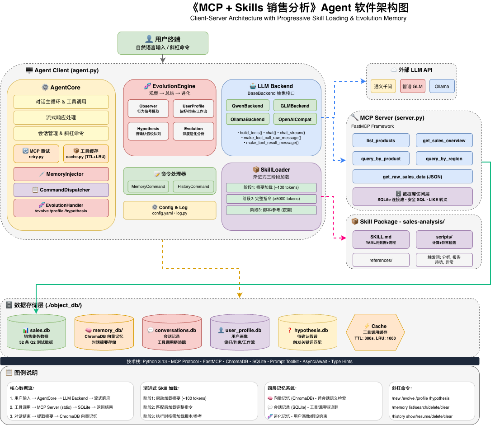

# MCP + Skills 销售分析 Agent

一个基于 MCP（Model Context Protocol）的 AI Agent 示例项目，演示如何通过 **MCP 工具 + Skills 技能包** 构建具备"专家级分析能力"的智能助手。

## ✨ 核心特性

- **🔧 MCP 工具调用**：基于 FastMCP 实现标准化工具协议，支持多步工具链调用、连接重试机制
- **📦 渐进式 Skill 加载**：三阶段按需加载（摘要→完整指令→脚本/模板），最小化 Token 消耗
- **🧠 四层记忆系统**：
  - **向量记忆**（ChromaDB）：跨会话语义检索，自动摘要存储
  - **会话记录**（SQLite）：完整对话回溯，工具调用链追踪（含耗时）
  - **进化式记忆**（用户画像 + 假设队列）：Agent 自我进化，学习用户偏好和约束
  - **工具缓存**（TTL + LRU）：相同查询秒级响应，命中率统计
- **🤖 多模型支持**：通义千问、智谱 GLM、Ollama 本地模型，统一后端抽象接口
- **💻 交互式界面**：REPL 终端模式，支持流式输出、命令补全和模型热切换

## 🏗️ 架构

```
用户终端（自然语言）
    ↓
agent.py（MCP Client + Skill Engine + LLM Backend + 四层记忆系统）
    ↓ stdio                                    ↕ ChromaDB          ↕ SQLite
server.py（MCP Server — 5 个销售数据工具）     memory_db/（长期记忆） conversations.db（会话记录）
    ↓                                                       ↕
sales.db（SQLite — 52 条 Q2 销售记录）        user_profile.db（用户画像 + 假设）
```



### 工具调用缓存

基于 TTL + LRU 的高效缓存机制：

- **自动缓存**：相同工具调用结果自动缓存
- **可配置 TTL**：默认 5 分钟过期（可在 config.yaml 中调整）
- **LRU 淘汰**：超出容量时自动淘汰最少使用条目
- **命中统计**：实时显示缓存命中率

| 配置项 | 默认值 | 说明 |
|--------|--------|------|
| `cache.ttl_seconds` | 300 | 缓存过期时间（秒） |
| `cache.max_size` | 1000 | 最大缓存条目数 |
| `cache.enabled` | true | 是否启用缓存 |

### MCP 连接重试

智能重试机制，确保服务稳定性：

- **指数退避**：1s → 2s → 4s，避免惊群效应
- **随机抖动**：±25% 随机偏移，分散重试请求
- **智能检测**：自动识别可重试的错误类型
- **可配置参数**：最大重试次数、基础延迟、最大延迟

### 长期记忆（向量数据库）

基于 ChromaDB 的语义向量记忆系统，支持跨会话记忆持久化：

- **自动保存**：对话结束（`/exit` 或 `Ctrl+C`）时，LLM 自动提取对话摘要存入向量库
- **自动检索**：每轮对话前，根据用户输入语义检索相关历史记忆注入 system prompt
- **手动管理**：通过 `/memory` 命令查看、搜索、清空记忆
- **存储位置**：`./object_db/memory_db/`（ChromaDB 持久化目录）

### 进化式记忆（用户画像）

Agent 自我进化能力，存储于 `./object_db/user_profile.db`：

- **UserProfileStore**：持久化用户画像（偏好/约束/工作流）
- **HypothesisStore**：管理待确认的假设约束队列
- **Observer**：观察每轮对话，提取用户行为信号
- **EvolutionEngine**：协调观察→总结→进化的完整流程
- **自动进化**：每轮对话后自动观察用户行为，提取偏好和约束
- **假设管理**：识别遗漏约束，生成待确认假设，用户确认后转为正式约束
- **/evolve 命令**：综合分析整个会话，批量更新用户画像

### 会话记录（SQLite）

基于 SQLite 的完整会话历史记录：

- **自动记录**：实时保存用户问题、Agent 回复、工具调用链（含耗时）
- **会话管理**：启动自动恢复上次会话，`/new` 创建新会话
- **调用链追踪**：记录每次工具调用的名称、参数、返回结果、耗时（ms）
- **会话导出**：支持 JSON/Markdown 格式导出
- **会话搜索**：按关键词搜索历史会话内容
- **工具追踪**：搜索使用过特定工具的会话
- **存储位置**：`./object_db/conversations.db`（SQLite WAL 模式）

### Skill 包结构（渐进式加载）

```
sales-analysis/
├── SKILL.md              # 核心大脑：元数据 + 执行流程 + 输出规范
├── scripts/
│   ├── calculate_metrics.py   # 指标计算（增长率/客单价/区域占比）
│   └── detect_anomaly.py      # 异常检测（Z-score/区域差异/波动率）
└── references/
    └── report_template.md     # 标准报告输出模板
```

**渐进式加载机制**：
1. **启动时**（~100 tokens）：仅加载 SKILL.md 的 name + description，用于技能路由
2. **匹配时**（<5000 tokens）：加载完整 SKILL.md 指令，解析业务 SOP
3. **执行时**（按需）：加载 scripts/ 或 references/，代码不暴露给模型上下文

## 🚀 快速开始

### 环境准备

```bash
# 安装依赖（使用 uv）
uv sync

# 配置 API Key
cp .env.example .env
# 编辑 .env 文件，填入你的 API Key
```

### 配置（可选）

```bash
# 复制配置文件
cp config.yaml.example config.yaml
# 按需修改配置（缓存TTL、重试策略等）
```

### 运行

```bash
# 初始化销售数据库（52 条 Q2 测试数据）
uv run init_db.py

# 启动 Agent（默认 REPL 模式，交互式选择模型）
uv run agent.py

# 单独运行 MCP Server（测试用）
uv run server.py
```

### 运行示例

启动后，你可以尝试以下对话：

```
👤 你：分析华东区的销售表现
📦 匹配到技能包：sales-analysis
   ✅ 技能指令已加载（完整 SKILL.md）
   ✅ 报告模板已加载（references/report_template.md）
🔧 调用工具：query_sales_by_region({"region": "华东"})...
🤖 Agent：📊 华东区销售分析报告
         总销售额：¥1,084,000.00
         成交笔数：42 笔
         平均客单价：¥25,809.52
         ...
```

```
👤 你：有哪些产品
🔧 调用工具：list_products({})...
🤖 Agent：📦 产品列表
         1. AI 助手基础版
         2. AI 助手专业版
         3. AI 助手企业版
         4. 数据分析模块
         5. 智能客服模块
```

```
👤 你：/history search 华东
🔍 找到 3 个匹配的会话：
   1. [20260405_100100]  💬 5 轮
      💬 分析华东区销售额，与华南区对比...
   2. [20260404_203500]  💬 3 轮
      💬 华东区域 Q2 数据概览...
```

```
👤 你：/history export
📤 选择要导出的会话：
   ❯ 20260405_100100  通义千问  💬5轮
     20260404_203500  智谱 GLM  💬3轮
     ...
✅ 会话已导出到：./exports/session_20260405_100100.md
```

```
👤 你：/evolve
🧬 正在深度分析对话历史，归纳用户画像...

🧬 分析完成！
   📌 总结：用户关注销售数据分析，偏好华东和华南区域对比
   🏷️ 新增偏好：2 条
   📐 新增约束：1 条
   🔄 新增工作流：0 条

🧬 当前用户画像：
══════════════════════════════════════════════════════
【偏好】2 条
   ✓ 关注华东区和华南区销售表现
   ✓ 重视数据可视化输出

【约束】1 条
   ✓ 需要对比分析不同区域

【工作流】0 条
══════════════════════════════════════════════════════
```

## 🔧 MCP 工具列表

| 工具名 | 功能 | 参数 |
|--------|------|------|
| `list_products` | 查询所有产品列表 | 无 |
| `query_sales_by_product` | 按产品查询销售数据（支持模糊匹配） | `product_name` |
| `query_sales_by_region` | 按区域查询销售数据（支持模糊匹配） | `region` |
| `get_sales_overview` | 全局销售概览 | 无 |
| `get_raw_sales_data` | 获取原始 JSON 数据（供脚本分析） | `product_name?`, `region?` |

## 🤖 支持的模型后端

| 后端 | 模型 | 环境变量 |
|------|------|----------|
| **通义千问** | qwen-max / qwen-plus / qwen-turbo | `DASHSCOPE_API_KEY` |
| **智谱 GLM** | GLM-4.5-Air / GLM-4-Flash | `BIGMODEL_API_KEY` |
| **Ollama** | qwen2.5:7b / llama3.2 等本地模型 | `OLLAMA_BASE_URL`, `OLLAMA_MODEL` |

### Ollama 本地模型配置

```env
# .env 文件
OLLAMA_BASE_URL=http://localhost:11434
OLLAMA_MODEL=qwen2.5:7b
```

确保本地已启动 Ollama 服务并拉取模型：
```bash
ollama pull qwen2.5:7b
ollama serve
```

## ⚙️ 配置管理

项目支持 YAML 配置文件（`config.yaml`），覆盖默认设置：

```yaml
# 数据库配置
database:
  pool_size: 5              # 连接池大小
  pool_timeout: 30           # 连接超时（秒）

# MCP Server 配置
mcp_server:
  retry_max_attempts: 3      # 最大重试次数
  retry_base_delay: 1.0     # 基础延迟（秒）
  retry_max_delay: 10.0     # 最大延迟（秒）
  timeout: 30.0             # 连接超时（秒）

# 缓存配置
cache:
  enabled: true              # 是否启用缓存
  ttl_seconds: 300          # 缓存 TTL（秒）
  max_size: 1000            # 最大缓存条目数

# 会话配置
session:
  export_dir: ./exports      # 会话导出目录
  max_history_display: 10    # 历史会话列表显示数量
```

## 📁 项目结构

```
.
├── agent.py                 # 入口：模型选择、AgentCore 初始化
├── agent/
│   ├── core.py             # Agent 核心：对话循环、工具调用、流式输出
│   ├── skill_loader.py     # 渐进式 Skill 加载器
│   ├── memory_injector.py  # 向量记忆 + 用户画像注入/保存
│   ├── evolution_handler.py # 进化引擎命令处理
│   ├── command_dispatcher.py # 斜杠命令定义、补全和分发
│   ├── retry.py            # MCP 连接重试机制
│   ├── cache.py             # 工具调用缓存（TTL + LRU）
│   ├── config.py            # 配置管理（YAML + 环境变量）
│   ├── log.py               # 统一日志系统
│   ├── backends/           # LLM 后端实现
│   │   ├── base.py         # BaseBackend 抽象基类
│   │   ├── openai_compat.py # OpenAI 兼容后端（GLM/Ollama 共享）
│   │   ├── qwen.py         # 通义千问后端
│   │   ├── glm.py          # 智谱 GLM 后端
│   │   └── ollama.py       # Ollama 本地模型后端
│   ├── commands/           # 斜杠命令处理器
│   │   ├── memory.py       # /memory 命令
│   │   └── history.py      # /history 命令（增强版）
│   └── evolution/          # 进化式记忆模块
│       ├── engine.py       # 进化引擎：协调观察→总结→进化
│       ├── observer.py     # 观察者：提取用户行为信号
│       ├── profile.py      # UserProfileStore：用户画像持久化
│       └── hypothesis.py   # HypothesisStore：待确认假设管理
├── server.py               # MCP Server（FastMCP，5 个销售工具）
├── memory_store.py         # ChromaDB 向量记忆封装
├── conversation_store.py   # SQLite 会话记录封装（增强版）
├── init_db.py              # 销售数据库初始化（52 条测试数据）
├── config.yaml.example     # 配置文件模板
├── sales-analysis/         # Skill 技能包
│   ├── SKILL.md            # 技能定义（元数据 + 执行流程 + 输出规范）
│   ├── scripts/            # 分析脚本（指标计算、异常检测）
│   └── references/         # 参考文件（报告模板）
├── object_db/              # 数据库统一存储目录（运行后自动创建）
│   ├── sales.db            # 销售业务数据
│   ├── memory_db/          # ChromaDB 向量记忆持久化
│   ├── conversations.db    # 会话记录与工具调用链
│   └── user_profile.db     # 用户画像与假设约束
├── exports/                # 会话导出目录（自动创建）
├── pyproject.toml          # 项目依赖配置
└── README.md               # 本文件
```

## 📝 斜杠命令

### 记忆管理

| 命令 | 说明 |
|------|------|
| `/memory list` | 列出最近 10 条记忆 |
| `/memory search <关键词>` | 语义搜索相关记忆 |
| `/memory delete <记忆ID>` | 删除指定记忆 |
| `/memory clear` | 清空所有记忆 |
| `/memory stats` | 查看记忆统计信息 |

### 会话管理

| 命令 | 说明 |
|------|------|
| `/new` | 创建新会话 |
| `/history` | 列出最近的会话记录 |
| `/history show` | 选择并查看会话详情（上下键选择） |
| `/history show <ID>` | 查看指定会话详情（含调用链） |
| `/history resume` | 恢复历史会话并继续对话（上下键选择） |
| `/history delete` | 删除指定会话（上下键选择） |
| `/history clear` | 清空所有历史会话 |
| `/history stats` | 查看会话统计 |
| `/history search [关键词]` | 搜索会话内容 |
| `/history export [ID]` | 导出会话（支持 JSON/Markdown） |
| `/history export [ID] format=json` | 导出为 JSON 格式 |
| `/history export [ID] format=markdown` | 导出为 Markdown 格式 |
| `/history tools [工具名]` | 搜索使用过指定工具的会话 |

### 用户画像进化

| 命令 | 说明 |
|------|------|
| `/evolve` | 主动总结归纳（深度分析用户画像） |
| `/profile` | 查看当前用户画像 |
| `/profile clear` | 清空用户画像 |
| `/hypothesis` | 查看待确认假设 |
| `/hypothesis clear` | 清空所有假设 |

### 模型切换

| 命令 | 说明 |
|------|------|
| `/model` | 显示当前模型和可用模型列表 |
| `/model qwen` | 切换到通义千问 |
| `/model glm` | 切换到智谱 GLM |
| `/model ollama` | 切换到 Ollama |

### 其他

| 命令 | 说明 |
|------|------|
| `/help` | 显示所有命令帮助 |
| `/exit` | 退出程序 |

## 🔑 关键设计模式

### 渐进式 Skill 加载
最小化 Token 成本，三阶段按需加载：
- **阶段 1**：启动时仅加载 name + description（~100 tokens）用于路由
- **阶段 2**：匹配后加载完整 SKILL.md（<5000 tokens）解析业务 SOP
- **阶段 3**：执行时按需加载 scripts/ 或 references/，代码不暴露给模型

### Backend 抽象层
统一接口 `BaseBackend`，支持多后端扩展：
- `build_tools()` - 将 MCP 工具转换为后端特定格式
- `chat()` / `chat_stream()` - 同步/流式对话
- `make_tool_call_raw_message()` / `make_tool_result_message()` - 工具调用消息构造
- `OpenAICompatibleBackend` - GLM/Ollama 共享实现
- `QwenBackend` - 通义千问独立 API

### Skill-Tool 协同
SKILL.md 定义业务流程和工具调用顺序，scripts/ 负责计算逻辑，references/ 提供输出模板。

### 进化式记忆系统
- **UserProfileStore**：持久化用户画像（preferences/constraints/workflows）
- **HypothesisStore**：管理待确认假设队列，用户确认后转为约束
- **Observer**：每轮对话后观察用户行为，提取行为信号
- **EvolutionEngine**：协调观察→总结→进化的完整流程
- **画像注入**：每轮对话前自动将用户画像注入 system prompt
- **假设提示**：根据用户输入触发相关假设提示，用户可确认/拒绝
- **深度分析**：`/evolve` 命令综合分析整个会话，批量更新画像

### MCP 连接稳定性
- **MCPSessionManager**：会话管理器，封装重试逻辑
- **指数退避**：自动延迟重试，避免雪崩
- **智能重试**：自动识别可重试的错误类型

### 工具调用缓存
- **TTL 过期**：默认 5 分钟自动过期
- **LRU 淘汰**：超出容量时自动清理
- **缓存统计**：实时追踪命中率和性能

## 📄 License

[MIT](LICENSE)
